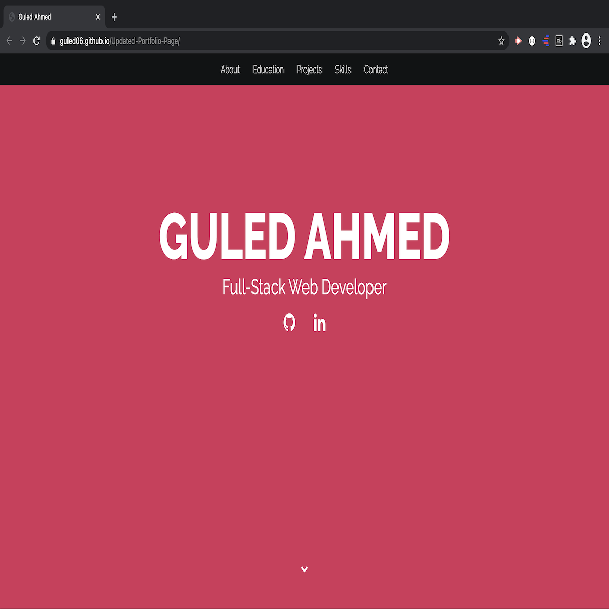
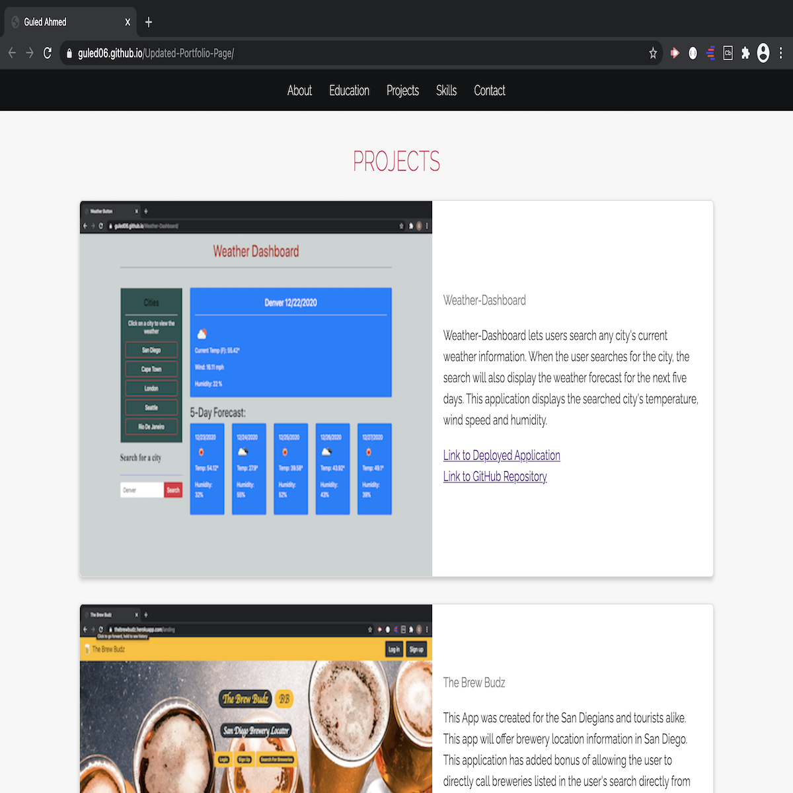

# Updated-Portfolio-Page

# Description: 

This is my updated portfolio. This portfolio was designed to give the reader an overview of who I am. In this portfolio I will be showcasing some of the projects I have worked on and the links to the GitHub repositories and deployed links of these projects will also be provided. I have included a link to my GitHub and LinkedIn profiles and my email. 

# Projects:

Under the 'projects' area of this portfolio, I have chosen to showcase four of my projects. I have included brief description for each project and a screenshot of the application. 

# Links: 

Deployed Link: https://guled06.github.io/Updated-Portfolio-Page/

# Screenshot Of Portfolio:

 

