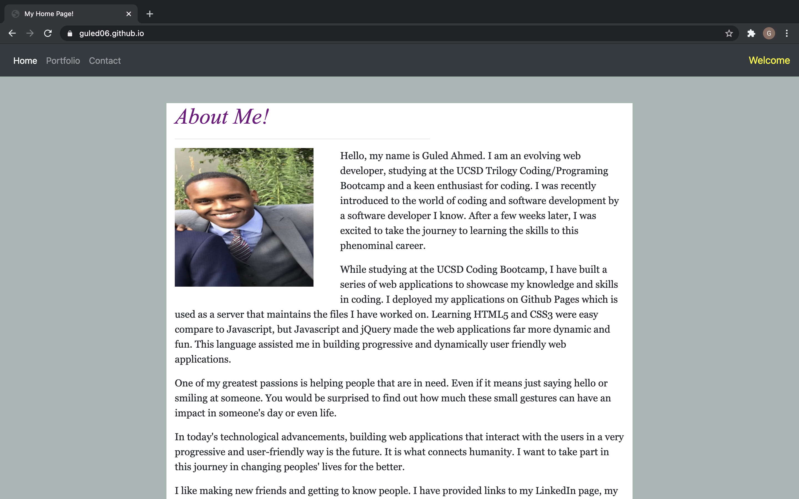
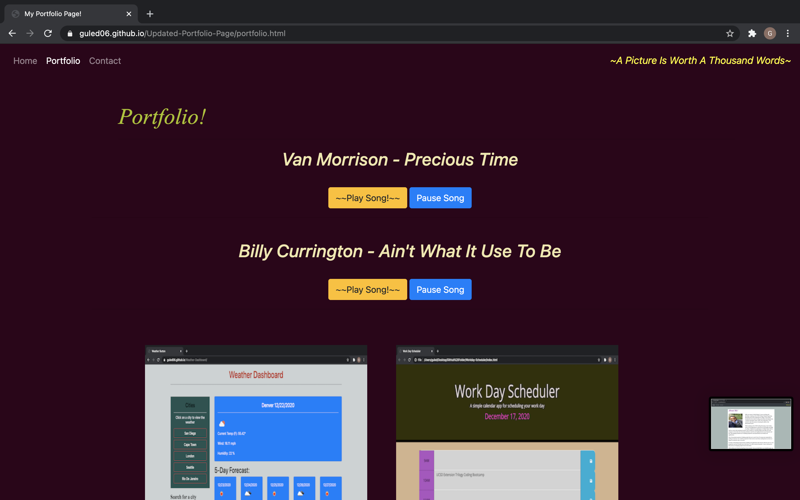
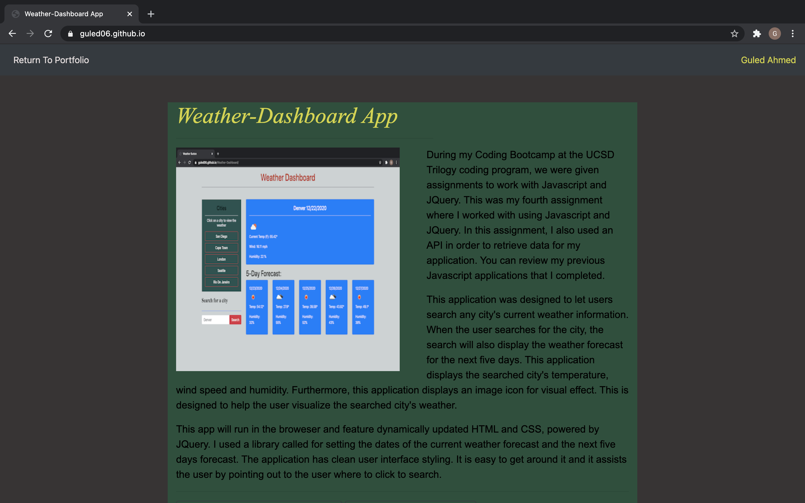
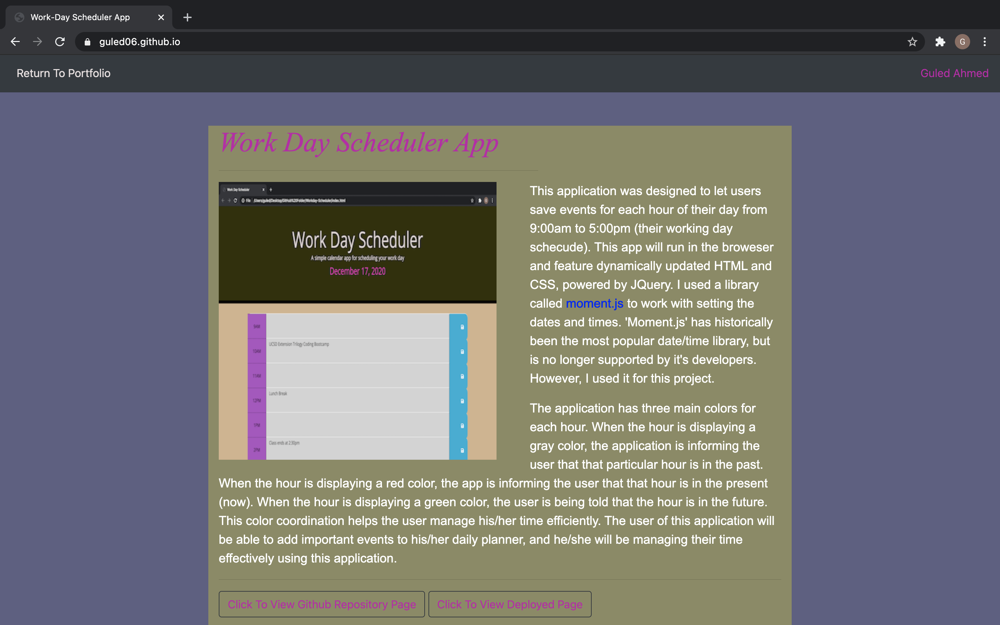

# Updated-Portfolio-Page
 
<h1>Home Page</h1>

The first page of my Updated Portfolio Page is the <a href ="https://guled06.github.io/Updated-Portfolio-Page/">Home</a> page. In this page, a recent picture of me is displayed with a a few paragraphs about myself and my journey to becoming a software developer. Previously, I created a portfolio application similar to this one, where I displayed a picture of myself and I shared a few paragraphs about myself. The reader of this readme file can visit my previous portfolio application and the user can see the stark difference in the older portfolio and the updated portfolio page. The amount of improvement I have made in the short period of time between the two applications is truly remarkable. The older portfolio application can be visited by clicking <a href="https://guled06.github.io/Bootstrap-Portfolio/">here</a>. This updated portfolio application will also have several other pages connected to it via buttons and links.

At the bottom of this page, I have displayed three button that can be clicked. The first button redirects the user to my LinkedIn page, the second button redirects the user to a page containing a screenshot of my resume and a downloadable link of my resume in pdf. If the third button is clicked, it will redirect the user to my Github repository page. 
<h1>Portfolio Page</h1>

The second page to my Updated Portfolio Page is the Portfolio page. This page displays 14 photos. The first three photo are a clickable photos that will redirect the user to a different page for each photo that is clicked. The purpose of these photos is to showcase my work and the web applications I built and/or contributed to in a group project.
<h3 style="color: yellow;">First Photo: Work-Day Scheduler Application Showcase</h3>

When the user clicks the most top-right photo, the user will be directed to another page that will display my Work Day Sheduler web application that I have worked on the in the past. That page will provide the user with two links, one link is to my Github repository page and the other link is to the deployed link for the web application.

<h3 style="color: rgb(117, 7, 128);">Second Photo: Weather-Dashboard Application Showcase</h3>
The next clickable photo is the most top-left photo. Once this photo is clicked, it will redirect the user to a page showcasing my Weather Dashboard we application. The user is provided a synopsis of what the application is about. The user is also provided with two links, one link to the Github repository and a link to the deployed web application.

<h3 style="color: rgb(117, 7, 128);">Third Photo: Coded-19 Project One Application Showcase</h3>

The third clickable photo is directly underneath the second clickable photo. Once this photo is clicked, the user will be redirected to a page that will describe what this web application was designed for, who designed it and what was used to design this web application. Just like the previous two, the user is provided with two links, one link to the Github repository of this application and the other link is for the deployed application.

The Portfolio page on my Updated Portfolio Page will also display two button that the user can click. Two predetermined songs will play once the user clicks either buttons. The user is also given an option to pause the songs.

<h1>Contact Page</h1>
The contact page on my Updated Portfolio Page displays a form where the user may write down his/her name, email and a brief message.
 
You can click this link to visit my Updated Portfolio Page <a href="https://guled06.github.io/Updated-Portfolio-Page/portfolio.html">CLICK HERE</a>.
<h1>Screenshot of my Updated Portfolio Page</h1>

